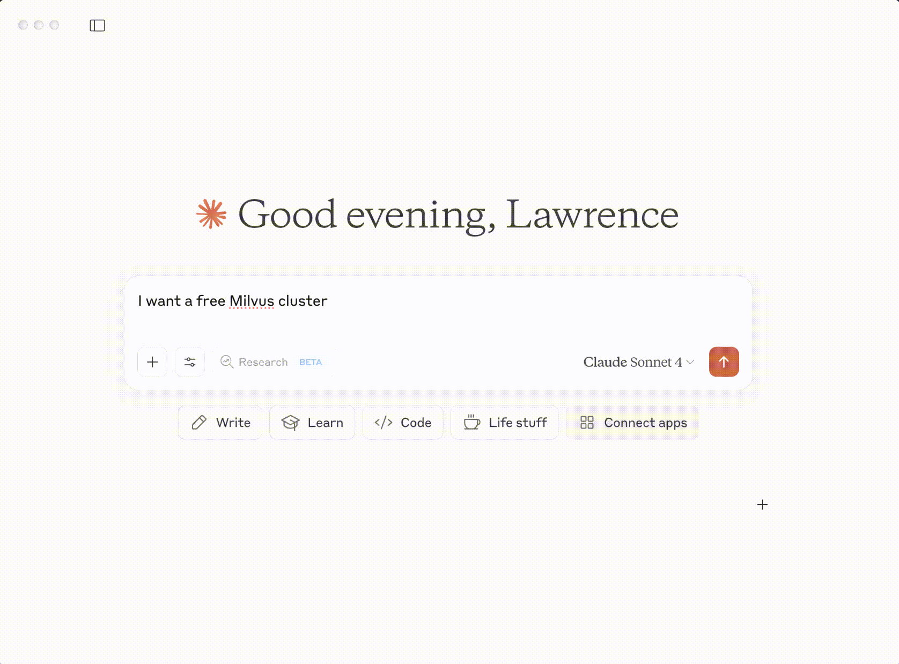

# Zilliz-MCP-Server

## 1. Zilliz-MCP-Server Overview 
Model Context Protocol (MCP) is a standardized framework that enables AI applications to securely connect to external data sources and tools in real-time. It acts as a universal interface between AI models and various systems, allowing AI assistants to access current information and perform actions beyond text generation.
**Zilliz MCP Server** enables AI agents to seamlessly interact with [Milvus](https://github.com/milvus-io/milvus), a popular open-source vector database, and [Zilliz Cloud](https://zilliz.com/cloud), the fully managed version of Milvus. Through this integration, your AI assistants can create collections, insert vector data, and perform semantic searches directly within their conversations—no manual database management required. Zilliz MCP Server seamlessly integrates with popular AI-powered coding tools like Cursor, Claude, Windsurf, and other MCP-compatible editors, enabling developers to build vector search capabilities directly within their development workflow.

## 2. Demos
### Demo 1: Create a free Milvus cluster with a simple natural language prompt

Instead of navigating through web interfaces or complex setup processes, you can get a free, fully functional vector database cluster up and running it directly from Claude, Cursor or any other MCP-compatible AI coding assistants with the Zilliz MCP Server. 
The Zilliz MCP server automatically:
- Provisions a free Milvus cluster using Zilliz Cloud
- Handles authentication and configuration
- Returns connection details for immediate use
No need to leave your AI chat interface or manually set up infrastructure. Just ask in natural language and get a working vector database within seconds. This works in any MCP-enabled environment, including Claude's web interface as shown above. 


### Demo 2: Monitor cluster performance without leaving your chat

Once you have a cluster running, you can inspect its status and generate visualizations directly through natural language:
The Zilliz MCP server:
- Retrieves real-time cluster metrics and collection details
- Fetches performance data (CPU computation, capacity usage)
- Generates visualizations on demand
- All without writing queries or accessing monitoring dashboards
This demonstrates how you can monitor and analyze your vector database infrastructure conversationally, making cluster management as simple as asking questions in plain English.

### Demo 3: Perform semantic search directly from your chat

Search your vector collections using natural language without writing any code:
The Zilliz MCP server:
- Performs semantic search across your specified collection
- Returns relevant results with similarity scores
- All through conversational interface - no SDK calls or query syntax required
This shows how vector search becomes as simple as describing what you're looking for. Perfect for testing search queries, exploring your data, or building search functionality without leaving your development environment.


## 3. Requirements

*   **Python**: 3.10 or higher.
*   **uv**: A fast Python package installer and resolver. If you don't have it, run  `brew install uv` on OSX， or just run `curl -LsSf https://astral.sh/uv/install.sh | sh` .
*   **Zilliz Cloud API Key**: You'll need an API key to interact with Zilliz Cloud. You can get one by following the instructions here: [Manage API Keys](https://docs.zilliz.com/docs/manage-api-keys).

## 4. Usage
You can start the server in two ways:


### 4.1. Standard I/O (StdIO)

This method is useful when the agent and the MCP server are running on the same machine and you want the agent to manage the server's lifecycle directly. The agent communicates with the server over its standard input and output streams.

Configure your agent's MCP JSON file like this:

```json
{
  "mcpServers": {
    "zilliz-mcp-server": {
      "command": "uvx",
      "args": ["zilliz-mcp-server"],
      "env": {
          "ZILLIZ_CLOUD_TOKEN": "your-token-here"
      }
    }
  }
}
```
*Note: Make sure to replace `/path/to/your/zilliz-mcp-server` with the actual absolute path to the project directory.*

### 4.2. Streamable HTTP

This method runs the server as a standalone HTTP service. This is useful for development and for agents that can communicate over HTTP.

First, clone or download the project repository.

```bash
git clone https://github.com/zilliztech/zilliz-mcp-server.git
cd zilliz-mcp-server
```

Next, create a `.env` file from the example and fill in your Zilliz Cloud API key.

```bash
cp example.env .env
```

Now, open `.env` and add your API key:

```
ZILLIZ_API_KEY="your_api_key_here"
```

It 'll start the MCP server as a standalone HTTP service
```bash
uv run src/zilliz_mcp_server/server.py --transport streamable-http
```

After starting the server, you can configure your MCP client to connect to it. If the server is running correctly, the available tools will appear in your client's tool list (e.g., in Cursor or Claude).

You can then configure your agent or MCP client to connect to it using a configuration like this:

```json
{
  "mcpServers": {
    "zilliz-mcp-server": {
      "url": "http://localhost:8000/mcp",
      "transport": "streamable-http",
      "description": "Zilliz Cloud and Milvus MCP Server"
    }
  }
}
```

## 5. Available Tools

The server exposes two categories of tools for your AI agents.

### Zilliz Control Plane Tools

These tools are for managing your Zilliz Cloud resources.

| Tool Name             | Description                                          |
| --------------------- | ---------------------------------------------------- |
| `list_projects`         | List all projects in your Zilliz Cloud account.      |
| `list_clusters`         | List all clusters within your projects.              |
| `create_free_cluster`   | Create a new, free-tier Milvus cluster.              |
| `describe_cluster`      | Get detailed information about a specific cluster.   |
| `suspend_cluster`       | Suspend a running cluster to save costs.   |
| `resume_cluster`        | Resume a suspended cluster.                |
| `query_cluster_metrics` | Query various performance metrics for a cluster.     |

### Milvus Data Plane Tools

These tools are for interacting with the data inside a Milvus cluster.

| Tool Name             | Description                                                              |
| --------------------- | ------------------------------------------------------------------------ |
| `list_databases`        | List all databases within a specific cluster.                            |
| `list_collections`      | List all collections within a database.                                  |
| `create_collection`     | Create a new collection with a specified schema.                         |
| `describe_collection`   | Get detailed information about a collection, including its schema.       |
| `insert_entities`       | Insert entities (data records with vectors) into a collection.           |
| `delete_entities`       | Delete entities from a collection based on IDs or a filter expression.   |
| `search`                | Perform a vector similarity search on a collection.                      |
| `query`                 | Query entities based on a scalar filter expression.                      |
| `hybrid_search`         | Perform a hybrid search combining vector similarity and scalar filters.  |
