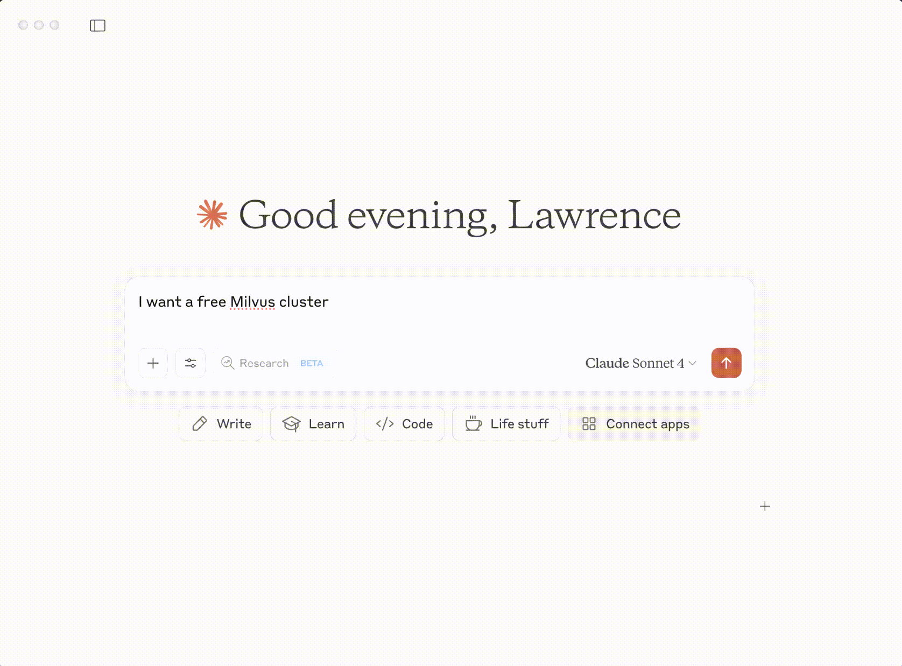

# Zilliz-MCP-Server

## 1. Why Zilliz-MCP-Server?

An MCP (Model-Controller-Personality) Server acts as a bridge, exposing a set of tools for AI agents to consume. It allows agents to interact with and control external systems, such as databases or cloud services, through a standardized interface. The Zilliz-MCP-Server specifically enables AI agents to seamlessly manage and query Zilliz Cloud, the fully-managed cloud vector database service, and Milvus, the popular open-source vector database. By providing a suite of powerful tools, this server empowers agents to build sophisticated applications on top of Zilliz and Milvus for tasks like RAG (Retrieval-Augmented Generation), semantic search, and more.

## 2. Your First Free Milvus in One Prompt

Choosing a vector database can be a hassle. We're making it easier than ever. With the Zilliz-MCP-Server, you can get your first free, fully-functional Milvus cluster up and running with just a single prompt. Stop deliberating and start building.



## 3. Requirements

*   **Python**: 3.10 or higher.
*   **uv**: A fast Python package installer and resolver. If you don't have it, run `pip install uv`.
*   **Zilliz Cloud API Key**: You'll need an API key to interact with Zilliz Cloud. You can get one by following the instructions here: [Manage API Keys](https://docs.zilliz.com/docs/manage-api-keys).

## 4. Usage

First, clone or download the project repository.

```bash
git clone https://github.com/zilliztech/zilliz-mcp-server.git
cd zilliz-mcp-server
```

Next, create a `.env` file from the example and fill in your Zilliz Cloud API key.

```bash
cp example.env .env
```

Now, open `.env` and add your API key:

```
ZILLIZ_API_KEY="your_api_key_here"
```

You can start the server in two ways:


### 4.1. Standard I/O (StdIO)

This method is useful when the agent and the MCP server are running on the same machine and you want the agent to manage the server's lifecycle directly. The agent communicates with the server over its standard input and output streams.

Configure your agent's MCP JSON file like this:

```json
{
  "mcpServers": {
    "zilliz-mcp-server": {
      "command": "uv",
      "args": [
        "--directory",
        "/path/to/your/zilliz-mcp-server",
        "run",
        "server.py"
      ]
    }
  }
}
```
*Note: Make sure to replace `/path/to/your/zilliz-mcp-server` with the actual absolute path to the project directory.*

### 4.2. Streamable HTTP

This method runs the server as a standalone HTTP service. This is useful for development and for agents that can communicate over HTTP.

```bash
uv run src/zilliz_mcp_server/server.py --transport streamable-http
```

After starting the server, you can configure your MCP client to connect to it. If the server is running correctly, the available tools will appear in your client's tool list (e.g., in Cursor or Claude).

You can then configure your agent or MCP client to connect to it using a configuration like this:

```json
{
  "mcpServers": {
    "zilliz-mcp-server": {
      "url": "http://localhost:8000/mcp",
      "transport": "streamable-http",
      "description": "Zilliz Cloud and Milvus MCP Server"
    }
  }
}
```

## 5. Available Tools

The server exposes two categories of tools for your AI agents.

### Zilliz Control Plane Tools

These tools are for managing your Zilliz Cloud resources.

| Tool Name             | Description                                          |
| --------------------- | ---------------------------------------------------- |
| `list_projects`         | List all projects in your Zilliz Cloud account.      |
| `list_clusters`         | List all clusters within your projects.              |
| `create_free_cluster`   | Create a new, free-tier Milvus cluster.              |
| `describe_cluster`      | Get detailed information about a specific cluster.   |
| `suspend_cluster`       | Suspend a running cluster to save costs.   |
| `resume_cluster`        | Resume a suspended cluster.                |
| `query_cluster_metrics` | Query various performance metrics for a cluster.     |

### Milvus Data Plane Tools

These tools are for interacting with the data inside a Milvus cluster.

| Tool Name             | Description                                                              |
| --------------------- | ------------------------------------------------------------------------ |
| `list_databases`        | List all databases within a specific cluster.                            |
| `list_collections`      | List all collections within a database.                                  |
| `create_collection`     | Create a new collection with a specified schema.                         |
| `describe_collection`   | Get detailed information about a collection, including its schema.       |
| `insert_entities`       | Insert entities (data records with vectors) into a collection.           |
| `delete_entities`       | Delete entities from a collection based on IDs or a filter expression.   |
| `search`                | Perform a vector similarity search on a collection.                      |
| `query`                 | Query entities based on a scalar filter expression.                      |
| `hybrid_search`         | Perform a hybrid search combining vector similarity and scalar filters.  |
