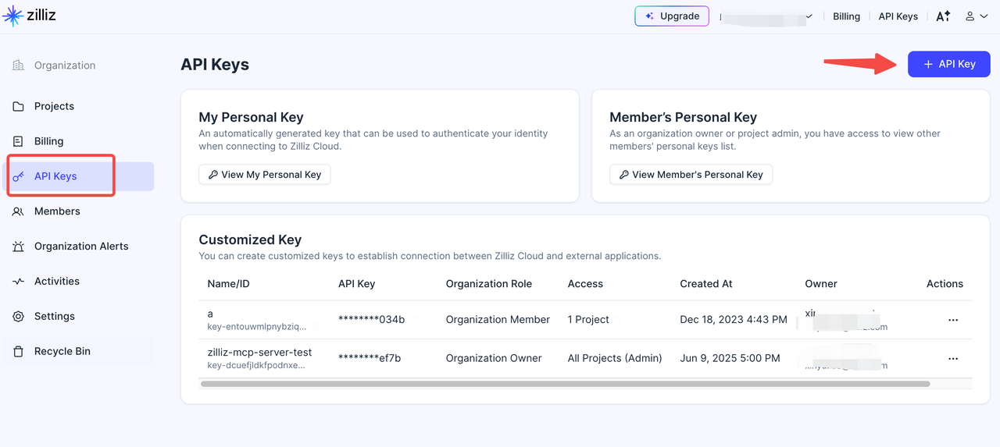
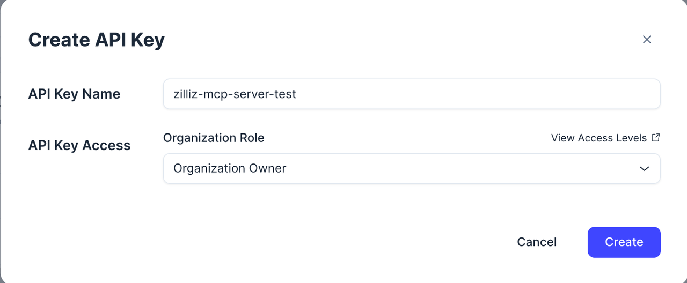
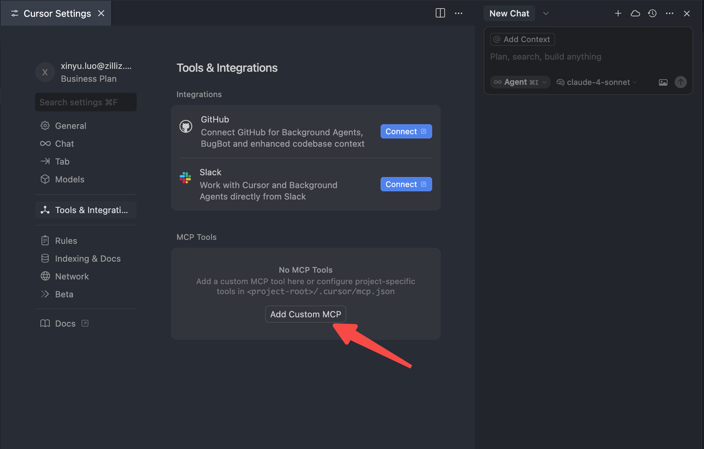
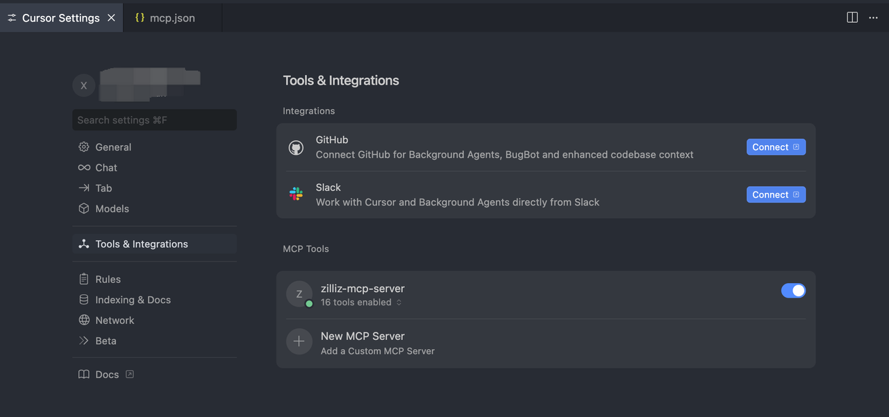

# Zilliz MCP Server User Guide

## Before You Begin

Ensure you have the following prerequisites:

### Required Components

- **A Zilliz Cloud account**: [Sign up for free here](https://cloud.zilliz.com/signup?utm_source=github&utm_medium=referral&utm_campaign=zilliz-mcp-user-guide) if you don't have one.
- **Zilliz API Key**
- **Python**: 3.10 or higher
- **uv**: Available on your PATH

### Getting Your Zilliz API Key

1. [Log into your Zilliz account](https://cloud.zilliz.com/login)
2. Open the root page of your organization
3. Click **'API keys'**



> **Note**: If you don't need fine-grained permission control for now—such as restricting a token to access only a specific project or instance—you can consider granting the API key Owner permissions at the Organization level to quickly test Zilliz-mcp-server.



For more information about the Zilliz API Key, please refer to the [Zilliz API Key Documentation](https://docs.zilliz.com/docs/api-key).

### Installing uv

If you don't have `uv` installed:

- **macOS**: `brew install uv`
- **Linux/Unix**: `curl -LsSf https://astral.sh/uv/install.sh | sh`

## Installation

### Clone the Project

```bash
git clone https://github.com/zilliztech/zilliz-mcp-server.git
cd zilliz-mcp-server
```

## Configuration

### Configure Cursor

#### 1. Add MCP Server

1. Open **Cursor Settings**
2. Select **Tools & Integrations**
3. Click **'Add Custom MCP'**



This will open `mcp.json`.

#### 2. Configure mcp.json

Replace the configuration with the following:

```json
{
  "mcpServers": {
    "zilliz-mcp-server": {
      "command": "uvx",
      "args": ["zilliz-mcp-server"],
      "env": {
          "ZILLIZ_CLOUD_TOKEN": "your-token-here"
      }
    }
  }
}
```

> **Important**: cu
> - Replace `YOUR_API_KEY` with your Zilliz API key

#### 3. Check MCP Server Status

1. Go to **Cursor Settings** > **MCP**
2. You should see the server and its list of tools


#### 4. Test the Server

Switch to agent mode and try asking questions like:
- "How many projects do I have?"
- "How many Milvus clusters do I have?"

### Configure Claude Desktop

#### 1. Add MCP Server

1. Go to **Settings** > **Developer** > **Edit Config**
[claude mcp settings](imgs/claude_mcp-setting.png)

2. This opens `claude_desktop_config.json`

#### 2. Configure claude_desktop_config.json

Add the following configuration:

```json
{
  "mcpServers": {
    "zilliz-mcp-server": {
      "command": "uvx",
      "args": ["zilliz-mcp-server"],
      "env": {
          "ZILLIZ_CLOUD_TOKEN": "your-token-here"
      }
    }
  }
}
```

> **Important**: 
> - Replace `YOUR_API_KEY` with your Zilliz API key

#### 3. Check MCP Server Status

1. **Restart Claude Desktop**
2. On the new chat screen, click the MCP server icon
3. You should see `zilliz-mcp-server` and its tools list
[claude tools list](imgs/claude_tools_list.png)

#### 4. Test the Server

Try asking Claude questions like:
- "How many projects do I have?"
- "How many Milvus clusters do I have?"

## Troubleshooting

If you encounter issues:

1. **Ensure Python and uv are properly installed** - This is the most common cause of MCP Server startup failures
   - Verify Python 3.10+ is installed: `python --version`
   - Verify uv is installed and available in PATH: `uv --version`
   - If uv is not installed, install it using the commands in the [Installing uv](#installing-uv) section
2. **Verify your API key** is correct and has appropriate permissions
3. **Restart your editor** after making configuration changes

## Support

For additional help and resources, visit the [Zilliz Documentation](https://docs.zilliz.com/).
